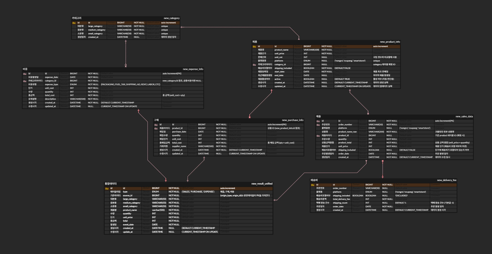

# ✨ 농산물 유통 데이터 자동 정산 시스템

### 📢 [배포 사이트] : 현재 운영 중으로 사이트 주소는 공개하지 않습니다.

## ✨ 프로젝트 소개

### [ 프로젝트 간단 소개 ]

본 프로젝트는 여러 e-커머스 플랫폼에서 판매되는 농산물의 매출 데이터를 자동 수집하고,  
매입·비용·수수료 정보를 함께 계산하여 순이익을 조회할 수 있는 정산 시스템입니다.

플랫폼마다 상이한 상품 정보를 제품·카테고리 기준으로 통합 관리하며,  
기간 및 상품 분류 기준의 정산 결과를 빠르게 조회할 수 있도록 설계했습니다.

1차·2차 개발을 거쳐 수동 입력 중심 구조에서 자동 수집 기반 구조로 개선했으며,  
현재는 클라우드 환경에서 실제 운영 중입니다. 
   

### [ 1차 프로젝트 개발 ]
#### 프로젝트 기간
- **기간**: 2개월 (2024.01 ~ 2024.02)

#### 주요 기능
- 비용·매입 데이터는 사용자 입력 방식으로 관리
- 매출·택배비 데이터는 엑셀 업로드 방식으로 수집
- 카테고리 기준 정산 결과를 프로시저·배치로 Result 테이블에 저장
- 월 단위 상품 분류별 순이익 리포트 제공

#### 한계
- 사용자 입력에 의존해 **제품 데이터 정합성 관리에 한계**
- 플랫폼별 상품명이 달라 **제품 통합 관리가 어려움**
- 누적 데이터 증가 시 **조회 성능 저하 우려**
   

### [ 2차 프로젝트 개발 ]
#### 프로젝트 기간
- **기간**: 1개월 (2025.07)

#### 주요 기능
- Selenium 기반 크롤러 모듈을 분리 배포하여 매출 데이터 자동 수집 파이프라인 구축
- 제품·카테고리 테이블 분리 및 ERD 재설계를 통해 제품 자동 관리 구조 개선
- UNIQUE 인덱스 + UPSERT 전략으로 플랫폼 간 상이한 상품 데이터 자동 통합
- 정산 조회 성능 향상을 위해 날짜 기준 파티셔닝 및 복합 인덱스 적용
- 정산용 통합 테이블을 도입해 조인 비용을 제거하고 기간·카테고리별 순이익 조회 최적화
   

## 📚 STACKS

<h3 align="center">Language</h3>

 
  <!-- Language -->
  
  

   

<h3 align="center">Backend</h3>

 
 
  
  

   

<h3 align="center">Database</h3>

  
  

   

<h3 align="center">DevOps / Infra</h3>

   

  
  
  

   

<h3 align="center">Frontend</h3>

   

  
  

 

## 🔎 프로젝트 화면

## 🎨 UseCase Diagram

## 🎨 ERD Diagram
### [ 2024년 1차 개발 시 ERD ]

### [ 2025년 2차 개발 시 ERD ]

 

## 🥲 시행착오들
[ 🐛MySQL - MySQL 프로시저 작성 및 호출하기 ](https://annacodingnote.blogspot.com/2024/03/mysql.html)  
[ 🐝Docker - 도커에서 MySQL 사용하기(설치) ](https://annacodingnote.blogspot.com/2024/02/mysql.html)  
[ 🪱Docker - 도커에서 MySQL 사용하기(오류) ](https://annacodingnote.blogspot.com/2024/02/springboot3-mysql.html)  
[ 🫎Apache POI - POI라이브러리 사용하기 ](https://annacodingnote.blogspot.com/2024/02/3-poi.html)  
[ 🦄SpringBoot3 - .yml 과 .properties 차이 ](https://annacodingnote.blogspot.com/2024/01/applicationyml-applicationproperties.html)  
[ 🐴SpringBoot3 - SpringBoot2에서 SpringBoot3로 업데이트하기 ](https://annacodingnote.blogspot.com/2024/01/springboot2-springboot3.html)  

 
