# ✨ 멀티 플랫폼 농산물 손익 정산 자동화

#### 📢 [배포 사이트] : 현재 운영 중으로 사이트 주소는 공개하지 않습니다.

### 🔗 관련 레포지토리
- 정산 서버(Spring Boot): [https://github.com/gam-data-project/spring-main.git](링크)
- 크롤러 배치(Python/Selenium): [https://github.com/gam-data-project/crawler-py-batch.git](링크)

## ✨ 프로젝트 소개

### [ 프로젝트 간단 소개 ]

여러 e-커머스 플랫폼에서 판매되는 농산물 상품 데이터를 자동 수집하고,  
기간별·상품별 순이익을 산출할 수 있도록 만든 정산 시스템입니다.

시스템 개발 전에는 동일 상품이 플랫폼마다 서로 다른 판매명, 가격, 판매 기간으로 관리되어  
통합 순이익 산출이 어려웠고, 이를 위해 매월 약 20시간의 수기 정산 업무가 필요했습니다.

이를 해결하기 위해 정산 시스템을 구축하고, 플랫폼별로 상이한 상품 데이터를 마스터 테이블 기반으로 통합 관리할 수 있도록 설계했습니다.  
이를 통해 기간별·분류별 순이익을 자동으로 조회할 수 있는 구조를 구현했습니다.

이후 두 차례의 고도화를 거쳐 Python 기반 크롤링을 도입해 판매 데이터를 자동 수집하도록 개선했고,  
누적 데이터 처리에 대응하기 위한 성능 최적화와 Slack 기반 장애 알림 체계를 적용해 운영 편의성과 안정성을 높였습니다.

   

### 📚 STACKS

<h3 align="center">Language</h3>

 
  
  

 

<h3 align="center">Backend</h3>

 
  
  
  
  

 

<h3 align="center">Database</h3>

  
  

 

<h3 align="center">DevOps / Infra</h3>

   
  
  
  
  

 

<h3 align="center">Frontend</h3>

   
  
  
  
  

 

## [ 최초 개발 ]
#### 개발 기간
- 2개월 (2024.01 ~ 2024.02)

### 주요 기능
- Spring Boot와 MyBatis 기반 정산 시스템 MVP 개발
- 비용·매입 데이터는 사용자 입력 방식으로 관리
- 매출·택배비 데이터는 엑셀 업로드 방식으로 수집
- 카테고리 기준 정산 결과를 프로시저·배치로 Result 테이블에 저장
- 월 단위 상품 분류별 순이익 리포트 제공

### 이후 개선 필요 사항
- 사용자 입력에 의존해 상품 데이터 정합성 관리에 한계
- 플랫폼별 상품명이 달라 상품 통합 관리가 어려움
- 수동 입력 기반 구조로 운영 효율이 낮음
   
### 🎨 UseCase Diagram
#### [ 2024년 최초 개발 시 UseCase ]

 

### 🎨 ERD Diagram
#### [ 2024년 최초 개발 시 ERD ]

 

### 🔎 UI
#### [ 2024년 최초 개발 시 화면 ]

 

## [ 1차 고도화 ]
#### 개발 기간
- 1개월 (2025.07)

### 문제 상황
- 통합 웹서비스에서 데이터 수기 입력으로 인해 휴먼에러와 추가 수정 시간이 발생
- 플랫폼마다 상품명, 가격, 옵션 정보가 달라 상품 데이터 통합 관리가 어려움
- 카테고리와 제품 정보가 하나의 구조에 섞여 있어 정산 분류와 상품 관리가 비효율적임

### 해결 방법
- Python(Selenium) 기반 크롤러를 추가 개발해 판매 데이터 자동 수집 파이프라인 구축
- 수집 데이터를 REST API로 정산 애플리케이션에 연계하고 MySQL 저장 자동화
- crontab 기반 배치로 수집·저장 프로세스를 자동화
- 제품·카테고리 테이블 분리와 ERD 재설계를 통해 상품 관리 구조 개선
- UNIQUE 인덱스와 UPSERT 전략으로 플랫폼 간 상이한 상품 데이터 자동 통합
- 정산용 통합 테이블을 도입해 기간·카테고리별 순이익 조회 구조 개선
   

### 🎨 ERD Diagram
#### [ 2025년 1차 고도화 시 ERD ]
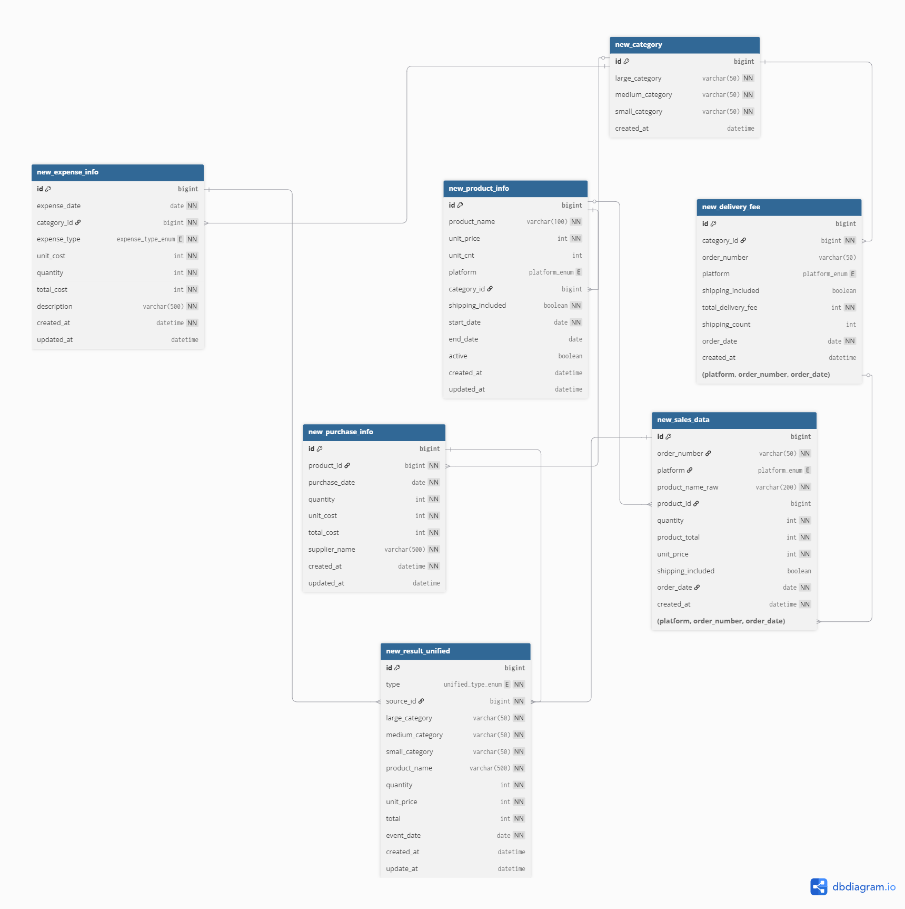

### ⚙️ System Architecture Diagram
#### [ 2025년 1차 고도화 시 아키텍처 ]
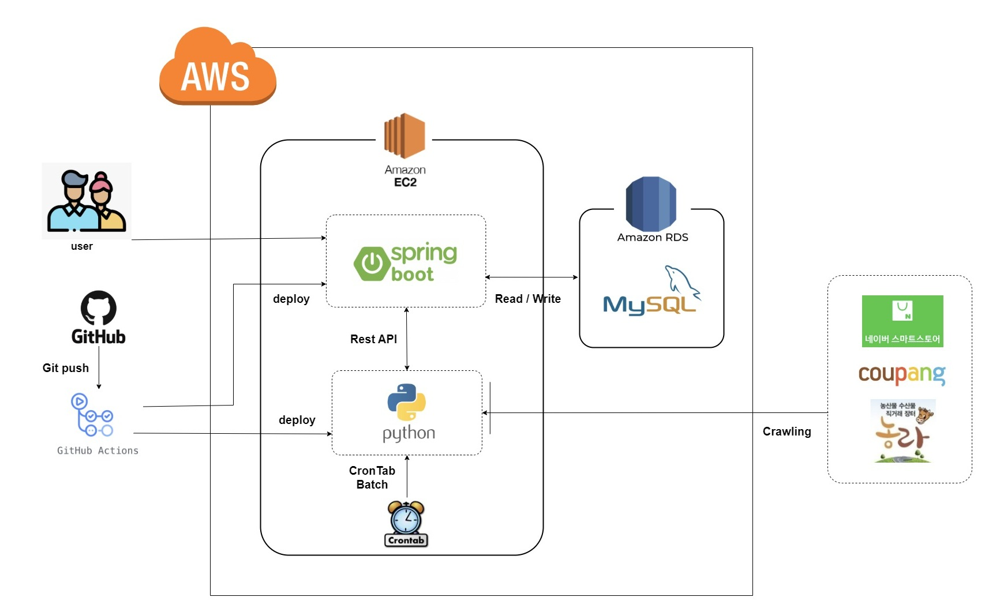

## [ 2차 고도화 ]
#### 개발 기간
- 2개월 (2026.05 ~ 2026.06)

### 문제 상황
- 운영 비용 증가로 인해 기존 AWS RDS 환경 유지 부담 발생
- 6개년 누적 약 40만 건 데이터 환경에서 조회 성능 저하 발생
- 건별 전송 구조로 인해 배치 장애 시 중복 적재와 부분 실패 대응이 어려움
- 수동 배포 방식으로 배포 누락, 환경 불일치, 장애 대응 지연 위험 존재

### 해결 방법
- 운영 비용 절감을 위해 데이터베이스 환경을 AWS RDS에서 EC2 기반 MySQL 서버로 전환
- 복합 인덱스 최적화를 통해 핵심 병목 쿼리 성능 42.9% 개선
- 건별 전송 구조를 Chunk 단위 전송·저장 방식으로 전환해 배치 안정성과 데이터 정합성 강화
- Slack 기반 배치 장애 알림을 적용해 장애 대응성과 운영 안정성 향상
- Docker·ECR 기반 배포 자동화를 구축해 운영 배포 효율 개선
 

### 🎨 UseCase Diagram
#### [ 2026년 2차 고도화 시 UseCase ]
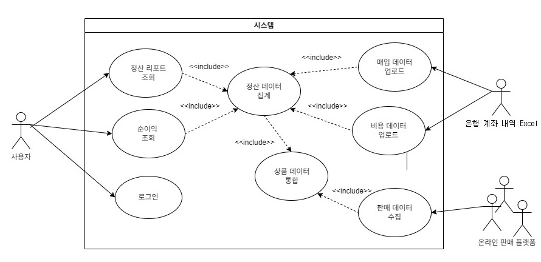
 

### 🎨 ERD Diagram
#### [ 2026년 2차 고도화 시 ERD ]
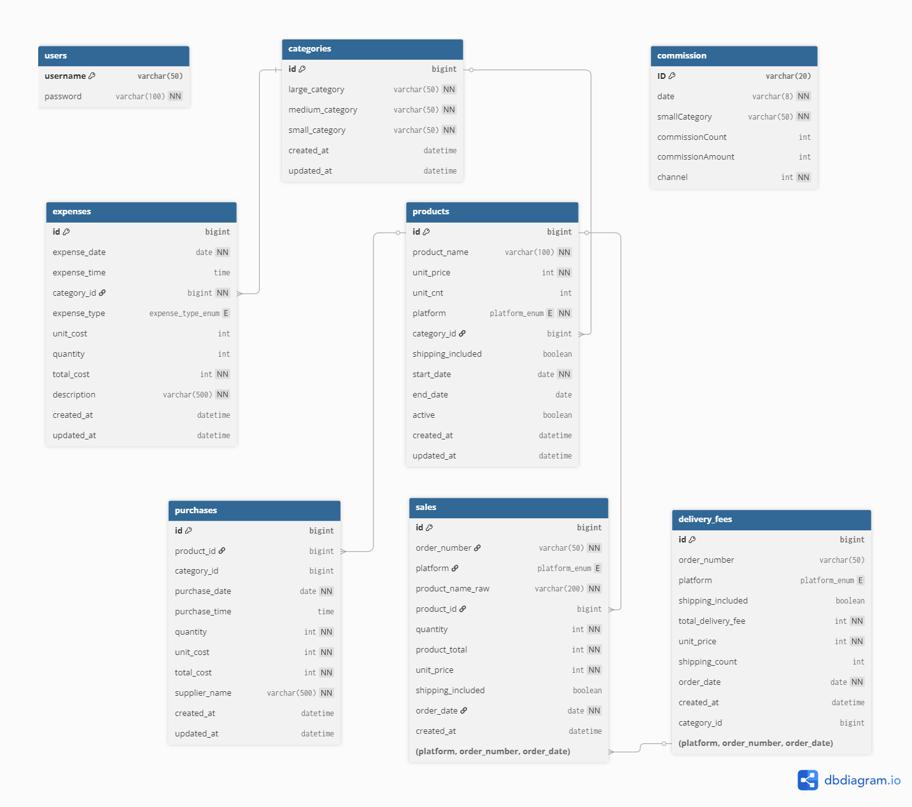
 

### ⚙️ System Architecture Diagram
#### [ 2026년 2차 고도화 시 아키텍처 ]
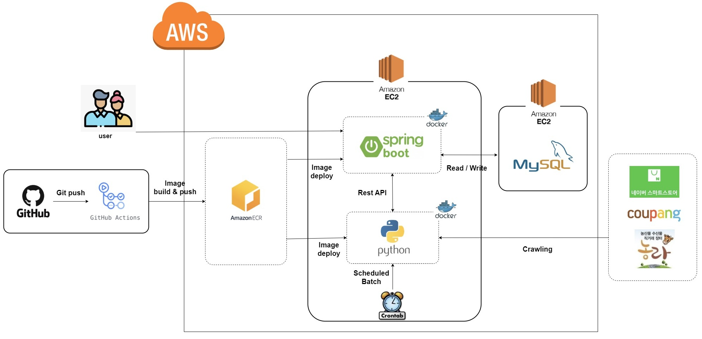
 

### 🔎 UI
#### [ 2026년 2차 고도화 시 화면 ]

<table>
  <tr>
    <td align="center">
      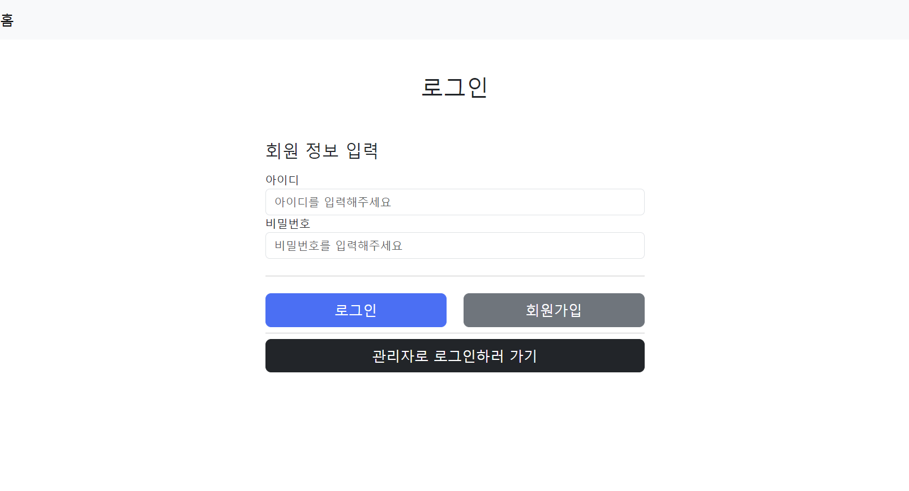 
      로그인
    </td>
    <td align="center">
      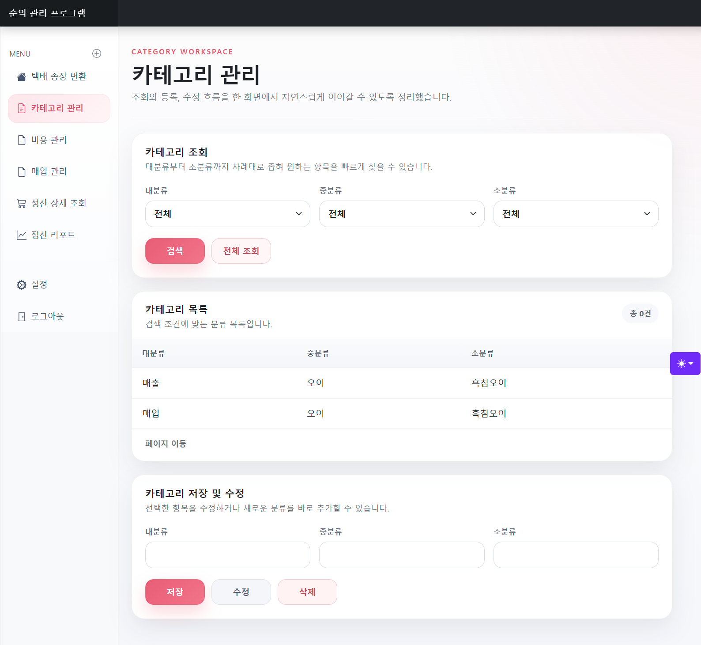 
      카테고리
    </td>
  </tr>
  <tr>
    <td align="center">
      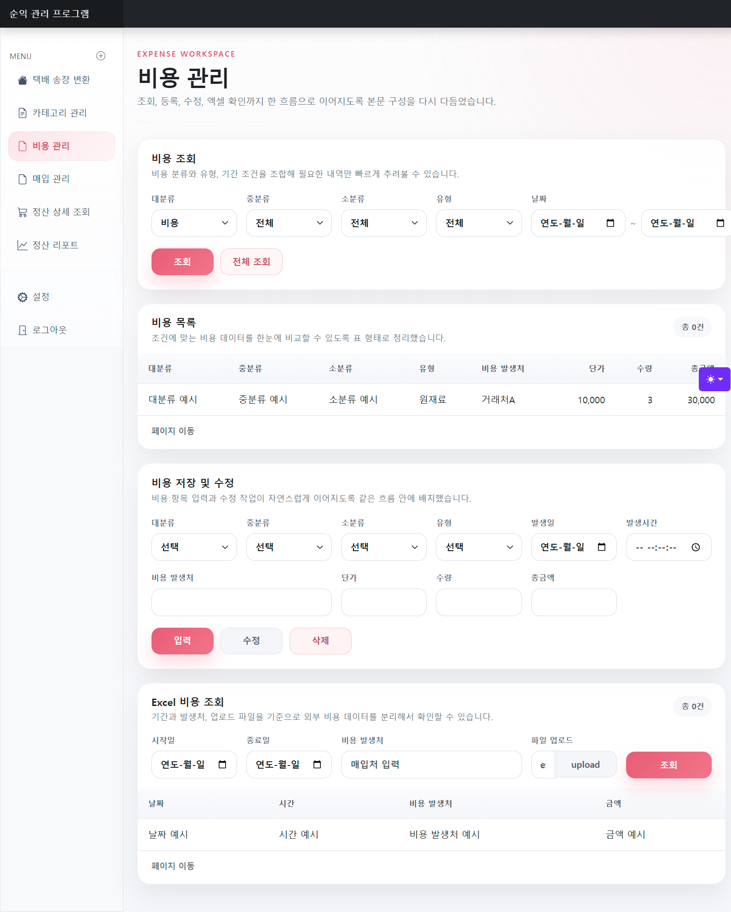 
      비용
    </td>
    <td align="center">
      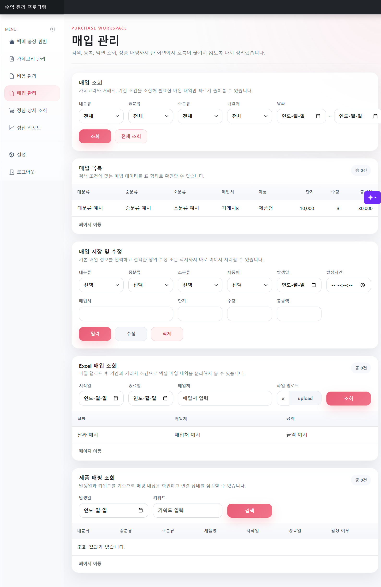 
      매입
    </td>
  </tr>
  <tr>
    <td align="center">
      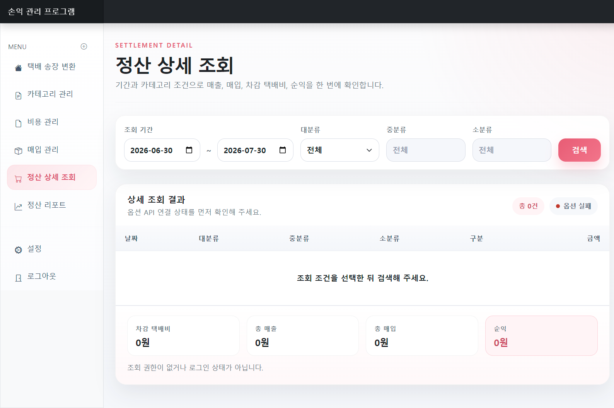 
      상세
    </td>
    <td align="center">
      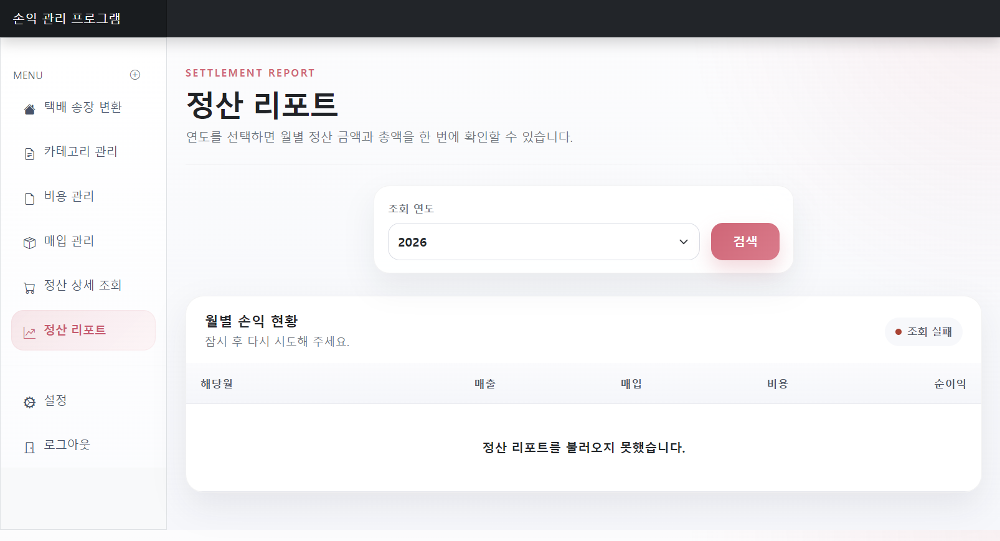 
      리포트
    </td>
  </tr>
</table>

 

## 🥲 시행착오들
[ 🐛MySQL - MySQL 프로시저 작성 및 호출하기 ](https://annacodingnote.blogspot.com/2024/03/mysql.html)  
[ 🐝Docker - 도커에서 MySQL 사용하기(설치) ](https://annacodingnote.blogspot.com/2024/02/mysql.html)  
[ 🪱Docker - 도커에서 MySQL 사용하기(오류) ](https://annacodingnote.blogspot.com/2024/02/springboot3-mysql.html)  
[ 🫎Apache POI - POI라이브러리 사용하기 ](https://annacodingnote.blogspot.com/2024/02/3-poi.html)  
[ 🦄SpringBoot3 - .yml 과 .properties 차이 ](https://annacodingnote.blogspot.com/2024/01/applicationyml-applicationproperties.html)  
[ 🐴SpringBoot3 - SpringBoot2에서 SpringBoot3로 업데이트하기 ](https://annacodingnote.blogspot.com/2024/01/springboot2-springboot3.html)  

 
